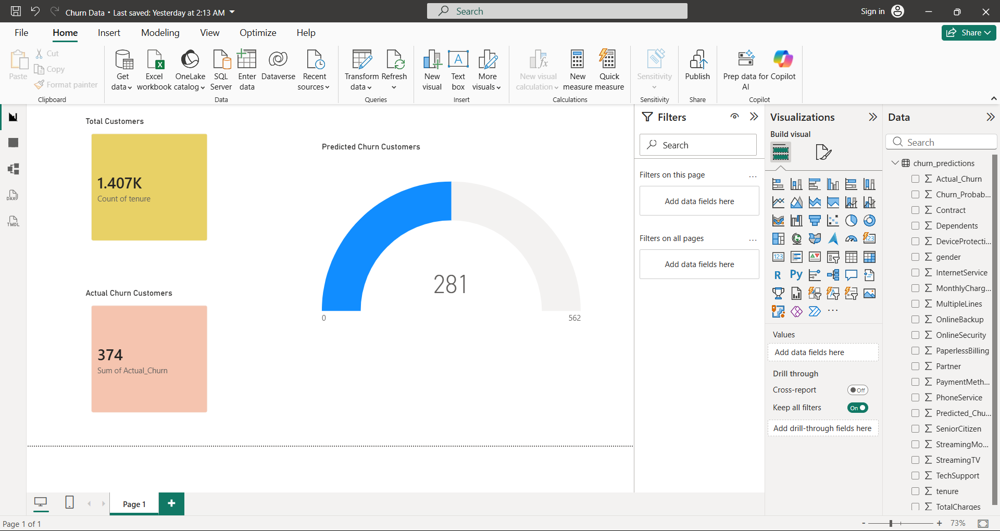

# 📊 Customer Churn Prediction System with ML API, Power BI & Docker

An end-to-end **Customer Churn Prediction** project that combines **Machine Learning**, **Flask REST API**, **Power BI analytics**, and **Docker containerization** to deliver a production-ready predictive system for telecom churn analysis.

---

## 🚀 Project Overview

Customer churn is a critical business problem in the telecom industry.
This project predicts the probability of a customer churning using historical customer data and provides actionable insights through interactive dashboards.

**Key Highlights**

* End-to-end ML pipeline (EDA → Model Training → Deployment)
* RESTful ML inference API using Flask
* Interactive Power BI dashboard for business insights
* Fully Dockerized for portability and deployment

---

## 🛠️ Tech Stack

**Programming & ML**

* Python
* Pandas, NumPy
* Scikit-learn

**Modeling**

* Logistic Regression
* Decision Tree
* Random Forest (Best Model)

**Backend**

* Flask (REST API)

**Analytics & Visualization**

* Power BI (KPIs, churn trends, customer segmentation)

**DevOps**

* Docker
* Git & GitHub

---

## 📂 Project Structure

```
churn-ml-api/
│
├── app.py                         # Flask ML inference API
├── churn_pipeline.pkl             # Trained ML pipeline
├── test_api.py                    # API testing script
├── requirements.txt               # Python dependencies
├── Dockerfile                     # Docker configuration
├── images/
│ └── powerbi_dashboard.png
└── README.md                      # Project documentation
```

---

## 📈 Machine Learning Workflow

1. **Data Cleaning & Preprocessing**

   * Removed irrelevant features (e.g., customerID)
   * Handled missing values and type conversions
   * Encoded categorical variables using pipelines

2. **Exploratory Data Analysis (EDA)**

   * Identified key churn drivers (tenure, contract type, charges)
   * Analyzed churn distribution and feature impact

3. **Model Training & Evaluation**

   * Compared multiple ML models
   * Evaluated using **Precision, Recall, and F1-Score**
   * Selected **Random Forest** as the best-performing model

4. **Model Deployment**

   * Exported trained pipeline using `joblib`
   * Served predictions via Flask REST API

---

## 🔌 Flask ML API

**Endpoint**

```
POST /predict
```

**Sample Request**

```json
{
  "gender": "Male",
  "SeniorCitizen": 0,
  "Partner": "Yes",
  "Dependents": "No",
  "tenure": 45,
  "InternetService": "Fiber optic",
  "Contract": "Month-to-month",
  "PaymentMethod": "Electronic check",
  "MonthlyCharges": 120.5,
  "TotalCharges": 3500
}
```

**Sample Response**

```json
{
  "churn_probability": 0.38
}
```

---

## 📊 Power BI Dashboard

The Power BI dashboard provides business-friendly insights into customer churn patterns and model predictions.

### 🔹 Key Metrics Displayed
- **Total Customers:** 1.4K+
- **Actual Churn Customers:** 374
- **Predicted Churn Customers:** 281
- Comparison between actual and predicted churn to evaluate model performance

### 🔹 Business Insights
- Helps stakeholders identify high-risk churn segments
- Supports proactive retention strategies
- Enables data-driven decision-making using KPIs

### 📷 Dashboard Preview




---

## 🐳 Docker Deployment

Build the Docker image:

```bash
docker build -t churn-ml-api .
```

Run the container:

```bash
docker run -p 5000:5000 churn-ml-api
```

API will be available at:

```
http://127.0.0.1:5000/predict
```

---

## 📌 Results & Impact

* Improved churn prediction accuracy using ensemble modeling
* Reduced manual analysis through automated ML inference
* Enabled business users to make data-driven decisions via dashboards
* Delivered a production-ready, portable ML system using Docker

---

## 👤 Author

**Ashutosh Ghodke**

---

## ⭐ If you like this project

Give it a ⭐ on GitHub and feel free to fork or contribute!

